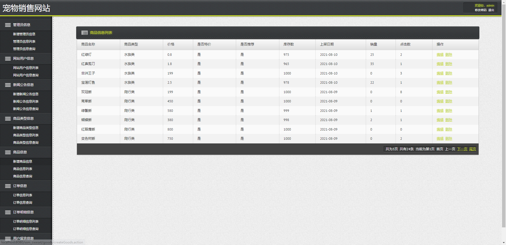

基于SSM的网上宠物店
=
### 完整代码获取地址：从戎源码网 ([https://armycodes.com/](https://armycodes.com/))
### 作者微信：19941326836  QQ：952045282 
### 承接计算机毕业设计、Java毕业设计、Python毕业设计、深度学习、机器学习
### 选题+开题报告+任务书+程序定制+安装调试+论文+答辩ppt 一条龙服务
### 所有选题地址https://github.com/nature924/allProject

一、项目介绍
---
本项目是一套基于SSM的网上宠物店，由两个大模块组成：前台用户界面和后台管理员界面。
### 
1.前台用户界面主要是分为：
查看部分宠物商品，查看宠物详细信息，查看更多商品，加入购物车，确认订购信息，修改购物车，部分删除购物车信息，清空购物车和提交订单等购物网站常见功能。
###
2.后台主要是管理员对网站信息的添加，更新、删除和查询。
分为：用户管理、宠物分类管理、宠物信息管理以及订单管理。用户管理包括用户信息查询和删除。商品管理包括商品录入，涉及图片传送功能。订单管理包括查询和删除订单。商品分类管理包括查询商品分类。添加用户身份的验证，商品限定购买数量验证等功能加强了各种信息的安全性。

二、项目技术
---
- 编程语言：Java
- 数据库：MySQL
- 项目管理工具：Maven
- 前端技术：JSP、HTML、Jquery、Layui、ECharts
- 后端技术：Spring、SpringMVC、MyBatis

三、运行环境
---
- 操作系统：Windows、macOS都可以
- JDK版本：JDK1.8以上都可以
- 开发工具：IDEA、Ecplise、Myecplise都可以
- 数据库: MySQL5.7以上都可以
- Tomcat：任意版本都可以
- Maven：任意版本都可以

四、运行截图
---

### 程序截图：

